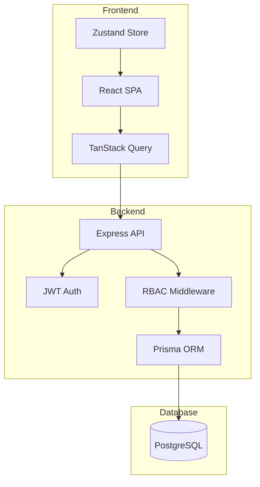
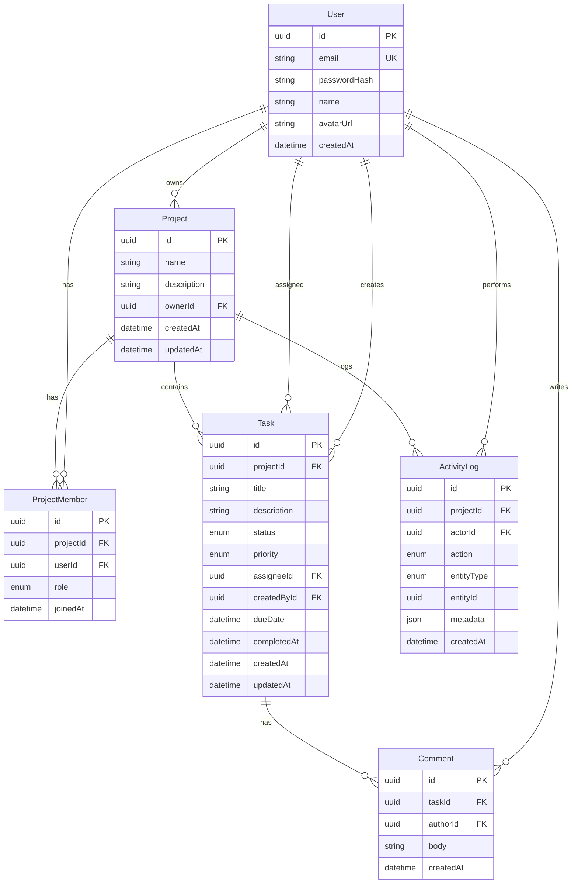

# TaskFlow

**Modern Project & Task Management Platform**

A production-grade project management application with Kanban boards, team collaboration, and role-based access control.

## Demo Credentials

| Role | Email | Password |
|------|-------|----------|
| Admin | admin@demo.com | Demo1234 |
| Member | member1@demo.com | Demo1234 |
| Member | member2@demo.com | Demo1234 |

## Features

- [x] **Kanban Boards** — Drag-and-drop task management
- [x] **Team Collaboration** — Invite members, assign roles
- [x] **Role-Based Access Control** — Admin and Member permissions
- [x] **Dashboard Analytics** — Task metrics and activity feed
- [x] **Dark Mode** — System-aware theme switching
- [x] **Command Palette** — Quick navigation (Cmd+K)
- [x] **Keyboard Shortcuts** — Power user friendly
- [x] **Real-time Activity** — Track all project changes
- [x] **Comments** — Collaborate on tasks
- [x] **Responsive Design** — Works on mobile

## Tech Stack

| Layer | Technology | Reasoning |
|-------|------------|-----------|
| Backend | Node.js + Express + TypeScript | Industry standard, type-safe API |
| Database | PostgreSQL + Prisma ORM | Relational data, type-safe queries |
| Auth | JWT (access + refresh tokens) + bcrypt | Stateless, secure authentication |
| Frontend | React + Vite + TypeScript | Fast dev experience, type safety |
| Styling | TailwindCSS + shadcn/ui | Utility-first, accessible components |
| State | TanStack Query + Zustand | Server state + UI state separation |
| Forms | React Hook Form + Zod | Performant forms, shared validation |
| Drag & Drop | @dnd-kit | Modern, accessible DnD |
| Deployment | Railway | Simple monorepo deployment |

## Architecture



## Database Schema



## RBAC Matrix

| Action | ADMIN | MEMBER |
|--------|-------|--------|
| View project | ✅ | ✅ |
| Update project settings | ✅ | ❌ |
| Delete project | ✅ | ❌ |
| Invite members | ✅ | ❌ |
| Remove members | ✅ | ❌ |
| Change member roles | ✅ | ❌ |
| Create tasks | ✅ | ✅ |
| Edit any task | ✅ | ❌ |
| Edit own task | ✅ | ✅ |
| Update assigned task status | ✅ | ✅ |
| Delete any task | ✅ | ❌ |
| Delete own task | ✅ | ✅ |
| Assign tasks | ✅ | ✅ |
| Add comments | ✅ | ✅ |
| View activity | ✅ | ✅ |

## Local Development

### Prerequisites

- Node.js 20+
- PostgreSQL 15+
- npm 10+

### Setup

```bash
# Clone the repository
git clone <repo-url>
cd taskflow

# Install dependencies
npm install

# Set up environment variables
cp apps/api/.env.example apps/api/.env
cp apps/web/.env.example apps/web/.env

# Edit apps/api/.env with your database credentials and JWT secrets

# Generate Prisma client
npm run db:generate -w @taskflow/api

# Run database migrations
npm run db:migrate -w @taskflow/api

# Seed demo data
npm run db:seed -w @taskflow/api

# Start development servers
npm run dev
```

The API runs on `http://localhost:3001` and the web app on `http://localhost:5173`.

## API Documentation

### Authentication

| Method | Endpoint | Description |
|--------|----------|-------------|
| POST | /api/v1/auth/signup | Create account |
| POST | /api/v1/auth/login | Sign in |
| POST | /api/v1/auth/refresh | Refresh access token |
| POST | /api/v1/auth/logout | Sign out |
| GET | /api/v1/auth/me | Get current user |
| PATCH | /api/v1/auth/profile | Update profile |
| POST | /api/v1/auth/change-password | Change password |

### Projects

| Method | Endpoint | Description | Auth |
|--------|----------|-------------|------|
| GET | /api/v1/projects | List user's projects | Required |
| POST | /api/v1/projects | Create project | Required |
| GET | /api/v1/projects/:id | Get project details | Member |
| PATCH | /api/v1/projects/:id | Update project | Admin |
| DELETE | /api/v1/projects/:id | Delete project | Admin |
| POST | /api/v1/projects/:id/members | Invite member | Admin |
| PATCH | /api/v1/projects/:id/members/:userId | Update role | Admin |
| DELETE | /api/v1/projects/:id/members/:userId | Remove member | Admin |
| GET | /api/v1/projects/:id/activity | Get activity log | Member |

### Tasks

| Method | Endpoint | Description | Auth |
|--------|----------|-------------|------|
| GET | /api/v1/tasks/project/:projectId | List project tasks | Member |
| POST | /api/v1/tasks/project/:projectId | Create task | Member |
| GET | /api/v1/tasks/:id | Get task details | Member |
| PATCH | /api/v1/tasks/:id | Update task | Owner/Admin |
| DELETE | /api/v1/tasks/:id | Delete task | Owner/Admin |
| GET | /api/v1/tasks/:id/comments | Get comments | Member |
| POST | /api/v1/tasks/:id/comments | Add comment | Member |

### Dashboard

| Method | Endpoint | Description |
|--------|----------|-------------|
| GET | /api/v1/dashboard | Get dashboard data |

## Folder Structure

```
taskflow/
├── apps/
│   ├── api/                  # Express backend
│   │   ├── prisma/
│   │   │   ├── schema.prisma # Database schema
│   │   │   └── seed.ts       # Demo data
│   │   └── src/
│   │       ├── controllers/  # Route handlers
│   │       ├── middleware/   # Auth, RBAC, validation
│   │       ├── routes/       # API routes
│   │       ├── lib/          # Utilities (Prisma, JWT, errors)
│   │       ├── app.ts        # Express app
│   │       └── index.ts      # Server entry
│   └── web/                  # React frontend
│       └── src/
│           ├── components/   # UI components
│           ├── contexts/     # React contexts
│           ├── hooks/        # Custom hooks
│           ├── lib/          # Utilities
│           ├── pages/        # Page components
│           ├── stores/       # Zustand stores
│           ├── App.tsx       # Root component
│           └── main.tsx      # Entry point
├── packages/
│   └── shared/               # Shared Zod schemas & types
├── package.json              # Workspace config
├── railway.json              # Railway deployment config
└── README.md
```

## Deployment to Railway

### Prerequisites

1. Railway account
2. Railway CLI installed (`npm i -g @railway/cli`)

### Steps

1. **Create Railway Project**
   ```bash
   railway login
   railway init
   ```

2. **Add PostgreSQL**
   - In Railway dashboard, click "Add Service" → "Database" → "PostgreSQL"

3. **Configure API Service**
   ```bash
   cd apps/api
   railway up
   ```
   
   Set environment variables in Railway:
   - `DATABASE_URL` (auto-linked from PostgreSQL)
   - `JWT_ACCESS_SECRET` (generate with `openssl rand -base64 32`)
   - `JWT_REFRESH_SECRET` (generate with `openssl rand -base64 32`)
   - `NODE_ENV=production`
   - `CORS_ORIGIN=https://your-web-domain.up.railway.app`

4. **Configure Web Service**
   ```bash
   cd apps/web
   railway up
   ```
   
   Set environment variables:
   - `VITE_API_URL=https://your-api-domain.up.railway.app/api/v1`

5. **Generate Domains**
   - In Railway dashboard, go to each service → Settings → Generate Domain

## Keyboard Shortcuts

| Shortcut | Action |
|----------|--------|
| `Cmd/Ctrl + K` | Open command palette |
| `/` | Open command palette |
| `c` | Create new task |
| `g p` | Go to projects |
| `g d` | Go to dashboard |
| `g h` | Go to home |

## Future Improvements

- [ ] Real-time updates with WebSockets
- [ ] File attachments on tasks
- [ ] Task dependencies
- [ ] Gantt chart view
- [ ] Email notifications
- [ ] GitHub/GitLab integration
- [ ] Time tracking
- [ ] Task templates
- [ ] Mobile app (React Native)
- [ ] API rate limiting per user
- [ ] Audit log export
- [ ] SSO integration

## License

MIT

---

Built for nomination submission. Modern project management that ships.
