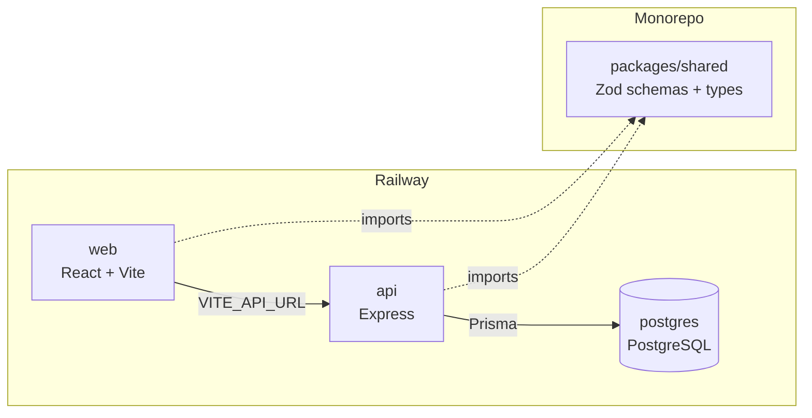

# TaskFlow

> Modern project & task management with role-based access control.

**Live demo:** https://web-production-d276d.up.railway.app  
**API:** https://api-production-e0de.up.railway.app

## Demo credentials

| Role   | Email              | Password |
|--------|--------------------|----------|
| Admin  | admin@demo.com     | Demo1234 |
| Member | member1@demo.com   | Demo1234 |

## Screenshots


## Features

- JWT auth with access + refresh tokens, bcrypt password hashing
- Role-based access control (Admin / Member) enforced server-side on every mutation
- Project + team management with member invites and role changes
- Task creation, assignment, status tracking, comments
- Kanban board with drag-and-drop (@dnd-kit) and optimistic updates
- Dashboard: KPI cards, overdue tasks, recent activity, upcoming deadlines
- Dark mode, command palette (Cmd+K), keyboard shortcuts
- Skeleton loaders, toast notifications, empty states

## Tech stack

**Backend:** Node.js, Express, TypeScript, Prisma, PostgreSQL, Zod, JWT, bcrypt  
**Frontend:** React, Vite, TypeScript, TailwindCSS, shadcn/ui, TanStack Query, Zustand, React Hook Form  
**Deployment:** Railway (api, web, postgres as separate services)

## Architecture



## RBAC matrix

| Action                      | Admin | Member |
|-----------------------------|-------|--------|
| Create project              | Yes   | Yes    |
| Edit project settings       | Yes   | No     |
| Delete project              | Yes   | No     |
| Invite members              | Yes   | No     |
| Change member roles         | Yes   | No     |
| Create task                 | Yes   | Yes    |
| Edit any task               | Yes   | No     |
| Edit own task               | Yes   | Yes    |
| Delete any task             | Yes   | No     |
| Update assigned task status | Yes   | Yes    |
| Comment on tasks            | Yes   | Yes    |

All enforced via Express middleware (`requireProjectRole`). 10/10 RBAC smoke tests pass.

## API endpoints

### Auth (`/api/v1/auth`)

| Method | Path              | Auth     | Description          |
|--------|-------------------|----------|----------------------|
| POST   | /signup           | No       | Create account       |
| POST   | /login            | No       | Sign in              |
| POST   | /refresh          | No       | Refresh access token |
| POST   | /logout           | Required | Sign out             |
| GET    | /me               | Required | Get current user     |
| PATCH  | /profile          | Required | Update profile       |
| POST   | /change-password  | Required | Change password      |

### Projects (`/api/v1/projects`)

| Method | Path                   | Auth   | Role   | Description        |
|--------|------------------------|--------|--------|--------------------|
| GET    | /                      | Required | -      | List user projects |
| POST   | /                      | Required | -      | Create project     |
| GET    | /:id                   | Required | Member | Get project        |
| PATCH  | /:id                   | Required | Admin  | Update project     |
| DELETE | /:id                   | Required | Admin  | Delete project     |
| POST   | /:id/members           | Required | Admin  | Invite member      |
| PATCH  | /:id/members/:userId   | Required | Admin  | Update member role |
| DELETE | /:id/members/:userId   | Required | Admin  | Remove member      |
| GET    | /:id/activity          | Required | Member | Get activity log   |

### Tasks (`/api/v1/tasks`)

| Method | Path                  | Auth     | Role   | Description      |
|--------|-----------------------|----------|--------|------------------|
| GET    | /project/:projectId   | Required | Member | List tasks       |
| POST   | /project/:projectId   | Required | Member | Create task      |
| GET    | /:id                  | Required | -      | Get task         |
| PATCH  | /:id                  | Required | -      | Update task      |
| DELETE | /:id                  | Required | -      | Delete task      |
| GET    | /:id/comments         | Required | -      | Get comments     |
| POST   | /:id/comments         | Required | -      | Add comment      |

### Dashboard (`/api/v1/dashboard`)

| Method | Path | Auth     | Description         |
|--------|------|----------|---------------------|
| GET    | /    | Required | Get dashboard data  |

## Local setup

```bash
git clone https://github.com/SanoberRehman/TaskFlow.git
cd TaskFlow
npm install
cp apps/api/.env.example apps/api/.env  # set DATABASE_URL, JWT secrets
npm run db:generate -w @taskflow/api
npm run db:push -w @taskflow/api
npm run db:seed -w @taskflow/api
npm run dev
```

API runs on :3001, web on :5173.

## Deployment

Deployed to Railway as a monorepo with three services:

| Service  | Type            | Port |
|----------|-----------------|------|
| api      | Express         | 8080 |
| web      | Vite + serve    | 3000 |
| postgres | Managed plugin  | -    |

**Environment variables:**

| Service | Variable           | Description                    |
|---------|--------------------|--------------------------------|
| api     | DATABASE_URL       | PostgreSQL connection string   |
| api     | JWT_ACCESS_SECRET  | Access token signing key       |
| api     | JWT_REFRESH_SECRET | Refresh token signing key      |
| api     | CORS_ORIGIN        | Allowed origins (comma-sep)    |
| api     | NODE_ENV           | production                     |
| web     | VITE_API_URL       | API base URL (build-time)      |

## Project structure

```
taskflow/
├── apps/
│   ├── api/                      # Express backend
│   │   ├── prisma/
│   │   │   ├── schema.prisma     # Database schema
│   │   │   └── seed.ts           # Demo data seeder
│   │   └── src/
│   │       ├── controllers/      # Route handlers
│   │       ├── middleware/       # auth, rbac, validate, error-handler
│   │       ├── routes/           # auth, project, task, dashboard
│   │       ├── lib/              # prisma, jwt, errors
│   │       ├── test/             # Vitest tests
│   │       ├── app.ts            # Express app setup
│   │       └── index.ts          # Server entry point
│   │
│   └── web/                      # React frontend
│       └── src/
│           ├── components/       # UI components (ui/, layout, command-palette)
│           ├── contexts/         # auth-context, theme-context
│           ├── hooks/            # useKeyboardShortcuts
│           ├── lib/              # api client, utils
│           ├── pages/            # landing, login, signup, dashboard, projects, profile
│           ├── stores/           # Zustand stores
│           ├── App.tsx           # Router + providers
│           └── main.tsx          # Entry point
│
├── packages/
│   └── shared/                   # Shared between api and web
│       └── src/
│           ├── schemas.ts        # Zod validation schemas
│           ├── types.ts          # TypeScript interfaces
│           └── constants.ts      # Enums and constants
│
├── package.json                  # Workspace root
└── railway.json                  # Railway config
```

## Future improvements

- Real-time updates via WebSockets
- Email notifications for assignments and mentions
- File attachments on tasks
- Project-level analytics
- Mobile app
